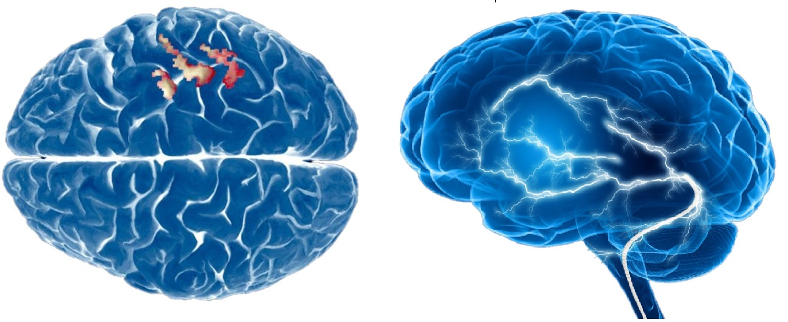
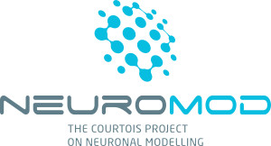

# BHS_project_SRastegarnia

## Presentation
I am a first-year Master student in computer science at Université de Montréal. My Master's project is about brain decoding and it is a part of a bigger project, the Courtois Neuromod. 

Since I am still in the early steps of my master’s project, my main goal is to learn as much as possible and making use of several tools that we have learned during BHS training courses.

## Summary
### Backgroung: Brain_decoding
Brain decoding or mind-reading using neuroimaging data has been an active topic for years. It is a neuroscience field that concerned about different types of stimuli from information that has already been encoded and represented in the brain by networks of neurons. 

### Project definition
For the BHS project I would like to run and compare the results of the different classifiers for brain decoding on the Haxby dataset.
The project aims to run Linear classifiers, Support vector machines, Random forests Decision trees, and Neural networks then will compare and examines their performance.

The goals of this project are:

•	Getting familiar with a brain decoding process in Python

•	Writing a Python-based machine learning/deep learning codes for this approach

•	Analyzing the results and see the difference for the different model using python plot

•	Moreover, trying to integrate as much as tools I was introduced during training week

I would like to work with other people, so if you have similar interests lets get in touch!

### Tools
•	Git/Github

•	Nilearn

•	Python visualization, statistics and machine learning libraries (e.g. NumPy, Seaborn, scikit-learn, Matlplotlib, bokeh)

• Practicing terminal

### Data
For the purpose of this project, I am going to use Haxby et al. (2001) data set which is a block-design fMRI dataset from a study on face & object representation in the human ventral temporal cortex (involved in high-level visual processing of complex stimuli).The data set consisted of 6 subjects and 12 runs for each, a size that seems enough for this project.
### Deliverable
By the end of this project, I would provide:

•	Github repository including project description and python codes

•	Presentation slides

•	A jupyter notebook presentation for the project results

• A Jupyter Notebooks with the data analysis and visualization

•	The project gallery and final report

## Results
Coming soon...

## Conclusion and acknowledgement
Coming soon...

## TO-DO LIST
• ML model training/testing

• results plotting (visualization)

• Pushing codes and results on Github

• ....
