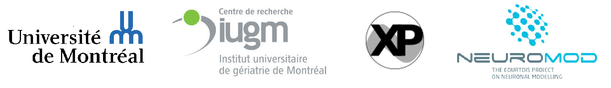

# BHS_project_SRastegarnia
This is the repository for my project of MONTREAL BRAINHACK SCHOOL, on May 2020.

## Presentation
Name: Shima Rastegarnia
Education:
* B.S in computer software engineering
* Master’s student in computer science at Université de Montréal (Jan. 2020)

Before starting my master's for a while, I was working at Simexp lab as a researcher assistant. When I joined the Simexp lab I had almost no neuroscience background but fortunately, it gave me the chance to become familiar with this field. My Master's project is about brain decoding and it is a part of a bigger project, the Courtois Neuromod.

 
Since I am still in the early steps of my master’s project, my main goal is to learn as much as possible and making use of several tools that we have learned during BHS training courses.

[My first presentation slides](https://drive.google.com/open?id=1ABaOXwWPks8xB28OlkiwDvqx7D0B2htQ)

## Summary

## Project definition
### Backgroung: Brain_decoding
Brain decoding or mind-reading using neuroimaging data has been an active topic for years. It is a neuroscience field that concerned about different types of stimuli from information that has already been encoded and represented in the brain by networks of neurons. 
In the human brain, the functional architecture of the object vision pathway can be investigated using fMRI.
It can be done by considering the patterns of response in the ventral temporal cortex while subjects are looking at the different objects. Several studies indicate that the brain responses to the vision of each category of objects are widely distributed and overlapping. Therefore, a distinct pattern of response exists for each stimulus category in the ventral temporal cortex.

### Project overview
For the BHS project I would like to run and compare the results of the different classifiers for brain decoding on the Haxby dataset.
The project aims to run Linear classifiers, Support vector machines, Random forests Decision trees, and Neural networks then will compare and examines their performance.

The goals of this project are:

*	Getting familiar with a brain decoding process in Python
*	Writing a Python-based machine learning/deep learning codes for this approach
*	Analyzing the results and see the difference for the different model using python plot
*	Moreover, trying to integrate as much as tools I was introduced during training week

### Tools
*	Git/Github
*	Nilearn
*	Python visualization, statistics and machine learning libraries (e.g. NumPy, Seaborn, scikit-learn, Matlplotlib, bokeh)
* Compute Canada/ Calcul Québec

### Data
For the purpose of this project, I will use the Haxby et al. (2001) data set which is a high-quality block-design fMRI dataset from a study on face & object representation in the human ventral temporal cortex (involved in the high-level visual processing of complex stimuli). The data set consisted of 6 subjects and 12 runs for each, a size that seems enough for this project.

[Haxby dataset](http://data.pymvpa.org/datasets/haxby2001/)

An examples of stimuli in Haxby dataset is as follow: (Distributed and Overlapping Representations of Faces and Objects in Ventral Temporal Cortex, Haxby et al. 2001)

## Deliverables
[Week 3 deliverable: data visualization](https://github.com/brainhack-school2020/BHS_project_SRastegarnia/blob/master/Data-visualization.ipynb)
Please check the visualization notebook using binder to see the interactive plot (cells 8 & 9) since the outputs are not shown without binder.

By the end of this project, I would provide:

*	Github repository including project description and python codes
*	Presentation slides
*	A jupyter notebook presentation for the project results
* A Jupyter Notebooks with the data analysis and visualization
*	The project gallery and final report

## Results
### Progress overview
*Coming soon...*
### Tools I learned during this project
*	Git/Github
*	Nilearn
*	Python visualization and machine learning
* Practicing terminal and some Shell commands
* Compute canada/ Calcul Québec
*	Python virtual environments

## Conclusion and acknowledgement
*Coming soon...*

### Results
*Coming soon...*

## Conclusion and acknowledgement

## TO-DO LIST
**Week 2:**
  - [x] Making my git and github repository
  - [x] Following Nilearn tutorial
  - [x] Figuring out my project subject
  - [x] Making my git and github repository

**Week 3:**
  - [x] Asking compute canada account update
  - [x] Learning and running the following classifiers:
    - [x] Support vector machine
    - [x] Logistic Regression
    - [x] Naive Bayes
    - [x] K-Nearest Neighbours
    - [x] Neural Networks
    - [x] Decision tree
   - [x] Learning and running cross validation for each classifier

**Week 4:**  
  - [x] Modifying existed plots: 
    - [x] color blind friendly
    - [x] adding legends
  - [x] Adding new interactable plot
  - [x] Checking each classifier confusion matrix
  - [x] Adding binder to my repo
  - [x] Adding visualization notebook
  - [x] Run the scripts on Compute Canada
  - [x] Polishing classifier notebook
  - [x] making presentation's slides
  - [x] Adding and running batch script on compute canada
  - [ ] <s>Create presentation ipython</s>
